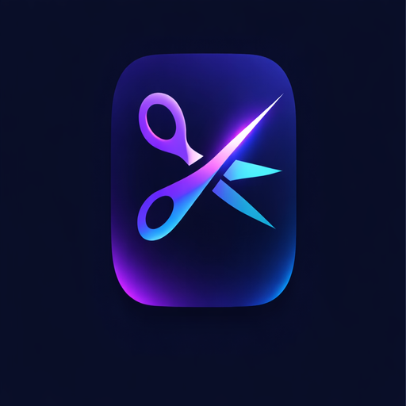

<p align="center">
  
</p>

# LightCutVidz

Trim, crop, filter and subtitle your videos, then export them — locally, with no external dependency to install. FFmpeg ships inside the app.

  

**Website** — <https://light-cut-vidz.github.io/light-cut-vidz/>

---

## Features

- **Open video** — drag & drop or `Ctrl/Cmd+O` (MP4, MOV, AVI, MKV, WebM, FLV, M4V)
- **Playback** — play/pause, seekbar with drag support; playback skips over cut zones
- **Speed control** — 0.25× to 4× with presets and fine-grained slider
- **Multi-segment trim** — draw cut zones on the timeline, adjust start/end with precise time inputs, delete individually
- **Timeline filmstrip** — thumbnail strip extracted from the video for visual reference
- **Crop** — draw a selection overlay, confirm with Enter or Apply; a red frame shows the active crop zone
- **Geometry** — 90° rotation, free straightening (±45°) and horizontal/vertical perspective correction
- **Filters** — 20 colour treatments (grayscale, sepia, vintage, noir, cold/warm, mirror, edges…), previewed live on the current frame
- **Subtitles** — import an `.srt` and burn it in, with 7 animation styles (word pop, bounce, highlight, rainbow, typewriter, sentence fade/slide) and full control over font, size, colours, outline, background and position
- **Mute** — toggle audio on/off
- **Undo / Redo** — full history for every edit via `Ctrl/Cmd+Z` / `Ctrl+Y`; a whole drag or slider scrub counts as one step
- **Export** — MP4, MOV, WebM, AVI, GIF with real-time progress bar
- **Full screen** — `F11` / `Ctrl+Cmd+F`, exit with `Escape`
- **Bilingual** — English and French, switchable from the Language menu

---

## Install

One command, identical on macOS and Linux:

```bash
curl -fsSL https://raw.githubusercontent.com/light-cut-vidz/light-cut-vidz/main/install.sh | bash
```

| Platform | What it installs |
|----------|------------------|
| macOS | Homebrew cask `light-cut-vidz/tap/light-cut-vidz` |
| Linux — Debian / Ubuntu | `.deb` package |
| Linux — other distributions | `.AppImage` in `~/.local/bin`, registered in your applications menu |

Re-run the exact same command to upgrade to the latest release.

> Apple Silicon only (M1/M2/M3/M4). The last version supporting Intel Macs is [v1.1.0](https://github.com/light-cut-vidz/light-cut-vidz/releases/tag/v1.1.0).

### Manual install

**macOS — Homebrew**

```bash
brew install --cask light-cut-vidz/tap/light-cut-vidz
```

**Linux — Debian / Ubuntu**

Download the `.deb` from the [latest release](https://github.com/light-cut-vidz/light-cut-vidz/releases/latest), then:

```bash
sudo apt install ./LightCutVidz-linux.deb
```

**Linux — other distributions**

Download the `.AppImage` from the [latest release](https://github.com/light-cut-vidz/light-cut-vidz/releases/latest), then:

```bash
chmod +x LightCutVidz-linux.AppImage
./LightCutVidz-linux.AppImage
```

---

## Usage

### 1. Import a video

On launch, you land on the home screen. Two options:
- **Drag & drop** a video file anywhere in the window
- Click **Browse files** or press `Ctrl/Cmd+O` to open the file picker

Supported formats: MP4, MOV, AVI, MKV, WebM, FLV, M4V

> When a video is opened, LightCutVidz automatically transcodes it to WebM for preview. This takes a few seconds depending on the file size — it is required because Electron does not ship with H.264/AAC codecs.

### 2. Playback controls

| Action | How |
|--------|-----|
| Play / Pause | Click the play button or press `Space` |
| Seek | Click or drag anywhere on the seekbar |
| Full screen | `F11` (Linux) / `Ctrl+Cmd+F` (macOS) or menu View → Toggle Full Screen |
| Exit full screen | `Escape` |

### 3. Speed

In the toolbar, click a speed preset or use the slider:

`0.25×` · `0.5×` · `0.75×` · `1×` · `1.25×` · `1.5×` · `2×` · `3×` · `4×`

The speed is applied both during playback and at export (via FFmpeg `setpts` + `atempo` filters).

### 4. Trim — Remove parts of the video

The timeline shows the full video duration. **Red zones = parts that will be removed.**

**Create a cut:**
1. Click and drag on the timeline to draw a red zone
2. Repeat as many times as needed — overlapping zones are automatically merged

**Adjust a cut:**
- **Move** — drag the center of a red zone
- **Resize** — drag the left or right edge
- **Edit precisely** — click a zone to open the time editor (type `1:23.4` or `83.5` seconds)
- **Delete** — click the `×` button on a zone, or select it and press the delete button in the editor

**Clear all cuts:** click **Clear all cuts** in the timeline bar.

### 5. Crop

1. Click **Crop** in the toolbar — a selection overlay appears on the video
2. Drag the corner handles to resize the crop area
3. Drag inside the selection to move it
4. Press **Enter** or click **✓ Apply** to confirm
5. A thin red frame appears on the video indicating the active crop zone

To reset the crop, click **Reset crop** in the toolbar.

### 6. Geometry, filters and subtitles

**Geometry** — click **Geometry** in the toolbar to rotate in 90° steps, straighten by a free angle, or correct horizontal/vertical perspective. **Reset** clears all four at once.

**Filters** — click **Filters** to pick one of 20 colour treatments. The grid previews each one on the frame currently displayed.

**Subtitles** — click **Subtitles**, then **Import .srt**. Once loaded you can choose an animation style and adjust font, size, text/outline/background colours, outline width, background opacity and vertical position. The preview over the video matches what gets burned in at export.

### 7. Audio

Click the **Sound / Muted** button in the toolbar to toggle.

- **Sound On** — audio is preserved at export
- **Muted** — audio track is removed at export

### 8. Undo / Redo

Every edit is undoable — speed, mute, crop, cuts, rotation, perspective, filters and subtitle styling:

| Action | Shortcut |
|--------|----------|
| Undo | `Ctrl+Z` / `Cmd+Z` |
| Redo | `Ctrl+Y` / `Cmd+Shift+Z` |

Or use the **Edit** menu.

A continuous gesture — dragging a cut, resizing the crop box, scrubbing a slider — is recorded as a single history entry, so one `Ctrl+Z` undoes the whole movement.

### 9. Export

Click **Export** in the toolbar.

1. Review the summary (output duration, speed, audio, crop, number of cuts)
2. Choose an output format:

| Format | Notes |
|--------|-------|
| MP4 | H.264 — best universal compatibility |
| MOV | QuickTime — ideal for macOS / Final Cut |
| WebM | VP9 — optimized for the web |
| AVI | Legacy Windows compatibility |
| GIF | Animated image (480px wide, 15 fps) |

3. Click **Export**, choose the output file location
4. A progress bar tracks the encoding — do not close the app during export

---

## Uninstall

**macOS — Homebrew**

```bash
brew uninstall --cask light-cut-vidz
brew untap light-cut-vidz/tap
```

Add `--zap` to also remove settings, caches and application data:

```bash
brew uninstall --zap --cask light-cut-vidz
```

**Linux — Debian / Ubuntu**

```bash
sudo apt remove lightcutvidz
```

**Linux — AppImage**

```bash
rm ~/.local/bin/lightcutvidz.AppImage
rm ~/.local/share/applications/lightcutvidz.desktop
rm ~/.local/share/icons/hicolor/512x512/apps/lightcutvidz.png
update-desktop-database ~/.local/share/applications
```

---

## Development

### Prerequisites

- Node.js 20+
- npm

### Setup

```bash
git clone https://github.com/light-cut-vidz/light-cut-vidz.git
cd light-cut-vidz
npm install --legacy-peer-deps
```

### Run in dev mode

```bash
npm run dev
```

Starts the Vite dev server on `localhost:5173` and opens the Electron window with hot reload.

### Build the packaged app

```bash
npm run build
```

Outputs to `dist-app/`:
- **Linux** → `LightCutVidz-linux.AppImage` + `LightCutVidz-linux.deb`
- **macOS** → Homebrew only (`brew install --cask light-cut-vidz/tap/light-cut-vidz`)

### Scripts

| Command | Description |
|---------|-------------|
| `npm run dev` | Start Electron + Vite in development mode |
| `npm run build` | Build and package the app |
| `npm run vite:build` | Build the Vite frontend only |
| `npm run test` | Run unit tests |
| `npm run test:watch` | Watch mode |
| `npm run test:coverage` | Tests with coverage report |
| `npm run lint` | ESLint on renderer source |
| `npm run typecheck` | TypeScript type check (no emit) |

---

## CI / CD

Every push to `main` or `develop` runs the CI pipeline automatically:

1. **Lint** — ESLint
2. **Type check** — `tsc --noEmit`
3. **Tests** — Vitest with coverage artifact
4. **Build** — Vite frontend build artifact

### Release a new version

```bash
git tag v1.0.0
git push origin v1.0.0
```

The release workflow triggers on the tag and, in order:

1. creates a draft GitHub release;
2. builds the macOS archive on a macOS runner and the AppImage + deb on a Linux runner;
3. uploads every artifact and marks the release as latest;
4. recomputes the archive's SHA-256 and pushes an updated cask to
   [light-cut-vidz/homebrew-tap](https://github.com/light-cut-vidz/homebrew-tap),
   which is what `brew install --cask light-cut-vidz/tap/light-cut-vidz` installs from.

Step 4 is skipped when the `HOMEBREW_TAP_TOKEN` secret is absent.

---

## Project structure

```
light-cut-vidz/
├── src/
│   ├── main/                          # Electron main process (CommonJS)
│   │   ├── index.js                   # IPC handlers, FFmpeg export pipeline, window & protocol setup
│   │   ├── filters.js                 # filter id → ffmpeg filter string
│   │   ├── lib/
│   │   │   ├── videoFilters.js        # crop / rotate / perspective / speed filter chain
│   │   │   ├── subtitles.js           # cue → .ass generation, cut-timeline remapping
│   │   │   ├── updater.js             # per-install-method update flows (Homebrew, deb, AppImage)
│   │   │   ├── menu.js                # native menu template
│   │   │   ├── localProtocol.js       # lcv-file:// URL <-> path
│   │   │   ├── aboutWindow.js         # About dialog
│   │   │   ├── i18n.js                # main-process translations
│   │   │   ├── atempo.js              # atempo chaining outside [0.5, 2]
│   │   │   ├── asar.js                # unpacked-binary path fix
│   │   │   └── escapeHtml.js
│   │   └── __tests__/
│   ├── preload/
│   │   └── index.js                   # contextBridge — the renderer's only door to the main process
│   └── renderer/
│       └── src/
│           ├── App.tsx
│           ├── components/            # VideoPlayer, VideoControls, Timeline, FilmStrip, CutEditor,
│           │                          # CropOverlay, CropFrame, CompositionGrid, Toolbar, Filters,
│           │                          # GeometrySettings, SubtitlesPanel, SubtitleOverlay,
│           │                          # ExportModal, DropZone, Toast, icons
│           ├── hooks/
│           │   └── useHistory.ts       # unified undo/redo, with gesture coalescing
│           ├── messages/               # en.ts / fr.ts
│           ├── utils/                  # time, timeline, srt, subtitles, filters
│           └── __tests__/
├── html/                              # GitHub Pages landing page
├── install.sh                         # one-line installer (Homebrew on macOS, deb/AppImage on Linux)
├── .github/
│   └── workflows/
│       ├── ci.yml                     # lint + typecheck + tests + vite build
│       ├── release.yml                # build, publish, update the Homebrew tap
│       └── pages.yml                  # deploy html/ to GitHub Pages
├── vite.config.ts
├── vitest.config.ts
├── tsconfig.json
├── eslint.config.js
└── package.json
```

---

## Tech stack

| Layer | Technology |
|-------|-----------|
| Desktop shell | Electron 41 |
| UI | React 19 + TypeScript |
| Bundler | Vite 8 |
| Video processing | FFmpeg (bundled via `ffmpeg-static` + `@ffprobe-installer/ffprobe`) |
| FFmpeg Node API | `fluent-ffmpeg` |
| Packaging | `electron-builder` |
| Tests | Vitest + Testing Library |
| Linter | ESLint (flat config) |

### Architecture notes

**Why WebM for preview?**
Electron ships without patented codecs (H.264, AAC). When a video is loaded, the main process transcodes it to WebM (VP9 + Opus) using the bundled FFmpeg before handing it to the HTML5 player.

**Why `asarUnpack`?**
Native binaries cannot be executed from inside an `.asar` archive. The `asarUnpack` field in `package.json` and the `fixAsarPath()` helper in the main process ensure FFmpeg is always accessible on the filesystem.

**Undo / Redo**
All editable state (speed, mute, crop, cuts, geometry, filter, subtitles) is managed by a single `useEditorHistory` hook. Every setter snapshots the full previous state onto a stack, so Undo/Redo work uniformly across all edit types with no extra code per feature. Continuous gestures use `setLive`, which snapshots once at the start and edits in place until `endGesture()` — otherwise a drag would push one entry per pointer event.

**Why a custom `lcv-file://` scheme?**
The renderer has to read video files off disk. Serving them over `file://` requires `webSecurity: false`, which drops the same-origin policy for the entire renderer. Instead, the main process registers a privileged scheme (streaming enabled, so `<video>` can issue range requests and seek) and serves both the app's own HTML and the media through it — same origin, web security intact.

**Why `-pix_fmt yuv420p`?**
Given an odd frame size, libx264 silently switches to `yuv444p` / High 4:4:4 Predictive, which QuickTime, iOS and most hardware decoders cannot play. The export pipeline pins the pixel format and ends every filter chain on an even-dimensions guard.

---

## License

MIT — see [LICENSE](LICENSE).
